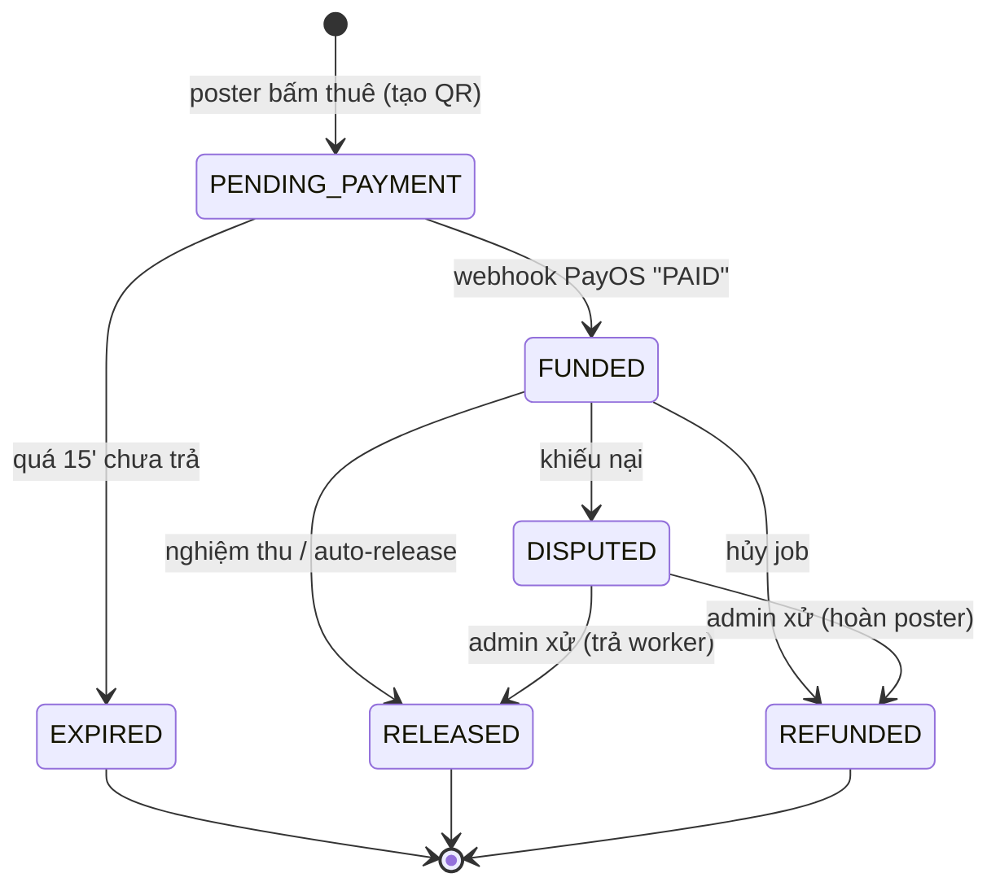
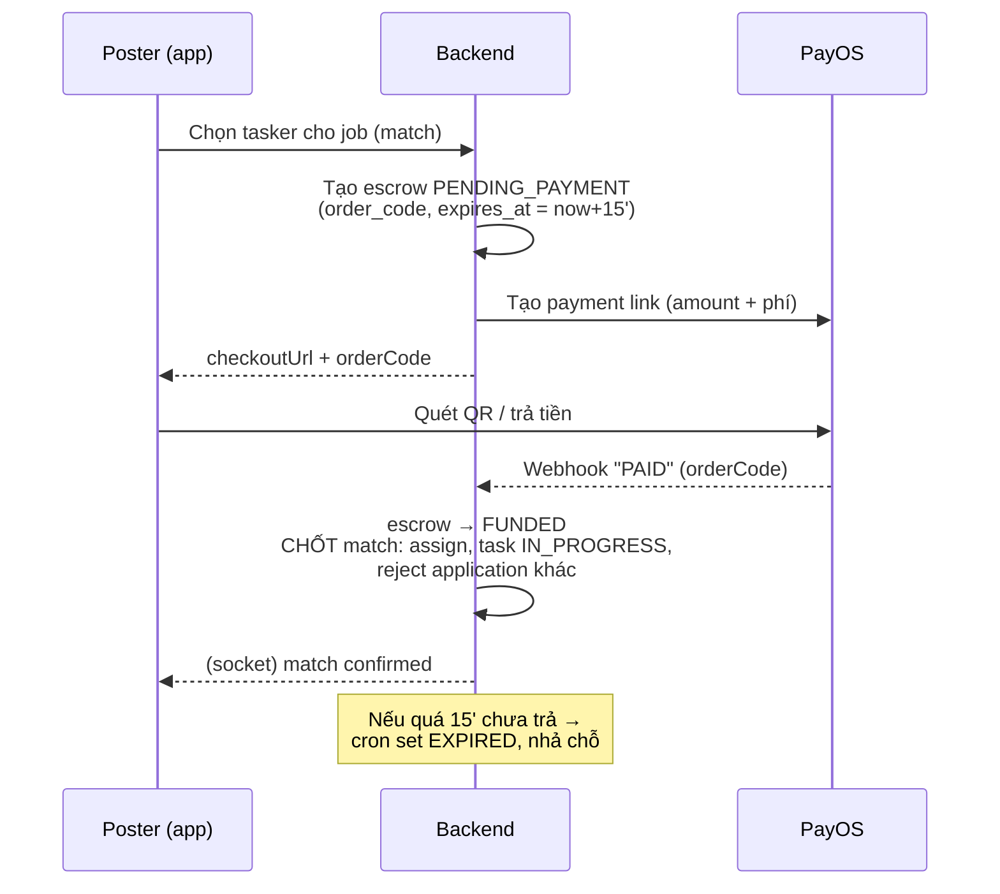
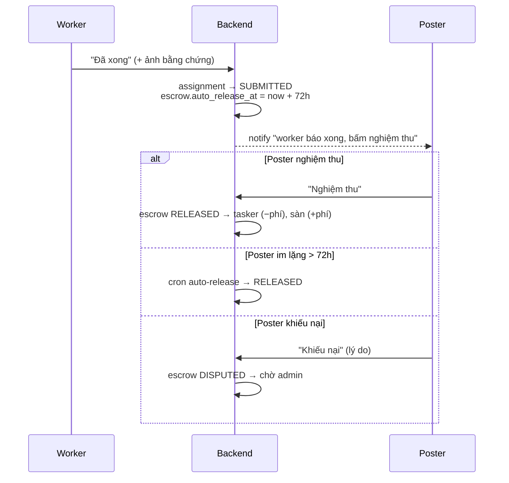

# Escrow Per-Job — Thiết kế dòng tiền cho SnapOn

> Bản thiết kế chuyển từ **ví lưu số dư (stored-value wallet)** sang **escrow theo từng job (escrow-per-job)**: bỏ nạp tiền vào ví, poster trả trực tiếp cho từng công việc qua PayOS, tiền được giữ trong escrow đến khi nghiệm thu, rồi nhả cho worker. Sổ cái nội bộ được giữ lại để đối soát.

Tài liệu này bám theo repo thật (file, hàm, enum). Dùng cho triển khai + báo cáo EXE202.

---

## 0) TL;DR

```
KHÔNG nạp ví.  Match → poster trả PayOS đúng tiền 1 job → tiền vào ESCROW (giữ tạm)
Worker "Đã xong" → Poster "Nghiệm thu"  → escrow NHẢ cho worker (− phí)
  ├─ poster im lặng quá 72h → TỰ NHẢ (chống ghost)
  └─ poster khiếu nại       → DISPUTED → admin xử
Worker rút tiền công → admin duyệt → chuyển khoản (đã build)
```

- **Poster: không còn ví.** Trả từng job.
- **Tasker: "ví" chỉ là sổ thu nhập chờ rút** (không nạp, không tiêu trong app).
- Tiền nằm ở **tài khoản escrow tách bạch**, DB chỉ ghi sổ.

---

## 1) Bối cảnh & lý do (pháp lý)

| Mô hình | Bản chất pháp lý VN | Rủi ro |
|---|---|---|
| Ví lưu số dư (nạp → giữ → tiêu dần) | = **Ví điện tử** → trung gian thanh toán | Cần **giấy phép NHNN** (vốn ≥ 50 tỷ, tài khoản đảm bảo thanh toán). Giữ tiền user không phép ≈ nhận tiền gửi trái phép |
| **Escrow từng giao dịch** (thu hộ → giữ tạm → chi hộ) | = thu/chi hộ qua cổng có phép | Nhẹ hơn nhiều — để chính PayOS (bên có phép) giữ tiền |

Căn cứ chính: **Nghị định 52/2024/NĐ-CP**, **Thông tư 40/2024/TT-NHNN**. Phần pháp lý cuối cùng cần xác nhận với luật sư fintech / PayOS.

---

## 2) Kiến trúc dòng tiền — 2 tài khoản

Tiền của mọi job nằm chung **1 tài khoản escrow gom** (pooled). "Ai sở hữu bao nhiêu" do **DB ghi sổ**, không tách bằng tài khoản ngân hàng.

```
┌─────────────────────────────┐     phí mỗi job      ┌──────────────────────────┐
│  TÀI KHOẢN ESCROW (gom)      │ ───────────────────▶ │  TÀI KHOẢN VẬN HÀNH      │
│  • tiền escrow đang giữ      │                      │  • doanh thu phí của sàn │
│  • tiền công tasker chờ rút  │                      │  • được tiêu tự do       │
│  KHÔNG tiêu vào vận hành     │                      └──────────────────────────┘
└─────────────────────────────┘
```

**Bất biến đối soát (kiểm tra hằng ngày):**
```
Số dư TK escrow ≥ Σ(escrow đang HOLDING) + Σ(tiền công tasker chờ rút)
```

> Lưu ý pháp lý: khi chưa có giấy phép, "TK escrow" thực chất vẫn là TK công ty (không được ring-fence). Phần được bảo vệ thật là quãng tiền **còn ở PayOS** → nguyên tắc: chi ra nhanh, giữ float tối thiểu.

---

## 3) Vòng đời Escrow (state machine)



| Trạng thái | Ý nghĩa | Tiền |
|---|---|---|
| `PENDING_PAYMENT` | Đã giữ chỗ, chờ poster trả | Chưa vào |
| `FUNDED` *(≈ HOLDING cũ)* | Đã trả, đang giữ | Trong escrow |
| `RELEASED` | Đã nghiệm thu | → tasker + sàn |
| `REFUNDED` | Đã hủy | → poster |
| `EXPIRED` | Poster không trả | Không phát sinh |
| `DISPUTED` | Đang tranh chấp | Đóng băng, chờ admin |

> Enum hiện tại (`escrow_status`) đã có `HOLDING/RELEASED/REFUNDED/DISPUTED`. Cần **thêm** `PENDING_PAYMENT`, `EXPIRED`. (`FUNDED` có thể tái dùng `HOLDING`.)

---

## 4) Luồng 1 — Match & thanh toán per-job (2 pha)

Khác biệt lớn nhất so với hiện tại: **match không còn tức thì**, mà là *giữ chỗ → chờ trả → chốt qua webhook*.



**Điểm móc code:**
- `escrowService.holdForMatch` → tách thành:
  - `createPendingEscrow({taskId, posterId, taskerId, amount})` — tạo escrow `PENDING_PAYMENT` + PayOS link. **Không đụng ví.**
  - `fundEscrow(orderCode, db)` — gọi từ webhook: set `FUNDED` + ghi ledger + **chốt match**.
- `matchingController.autoMatch` / `manualMatch` — bỏ khối "atomic hold + assign", thay bằng `createPendingEscrow` → trả `checkoutUrl`. Task **chưa** IN_PROGRESS.
- `applicationController` (chỗ cũng gọi `holdForMatch`) — sửa tương tự.
- `walletService.processPayOSWebhook` — thêm nhánh: order là escrow-funding (phân biệt qua `escrows.order_code`) → `fundEscrow` + chốt match trong cùng transaction.
- `assignmentExpiryService` — thêm quét `PENDING_PAYMENT` hết `expires_at` → `EXPIRED`.

---

## 5) Luồng 2 — Hoàn thành 2 bên + auto-release + dispute

Nguyên tắc: **happy path mượt, tranh chấp là ngoại lệ hiếm**. Bất đối xứng để chặn cả 2 phía gian lận:

| Hành động | Ai | Tác dụng |
|---|---|---|
| "Đã hoàn thành" | **Worker** | Chỉ là tín hiệu, bắt đầu đồng hồ. KHÔNG tự nhả |
| "Nghiệm thu" | **Poster** | Nhả tiền ngay |
| Auto-release | Hệ thống | Poster im lặng quá 72h → tự nhả |



**Chống gian lận:**

| Kịch bản xấu | Cơ chế chặn |
|---|---|
| Worker khai xong nhưng chưa làm | Không tự nhả; poster khiếu nại → admin giữ |
| Poster ghost để né trả | Auto-release 72h → worker vẫn nhận |
| Poster khiếu nại bừa | Bằng chứng ảnh của worker + rating tụt nếu lặp lại |
| Đã nhả rồi mới đòi khiếu nại | Khiếu nại **chỉ trong cửa sổ 72h**; nhả xong là chốt |

**Khác code hiện tại:** hiện `completeAssignment` / `taskController` cho **poster bấm 1 mình → nhả ngay**. Cần đổi: worker submit trước → poster nghiệm thu mới nhả (hoặc auto-release).

**Điểm móc code:**
- Worker: action mới "Đã xong" → `assigned_tasks.status = SUBMITTED`, set `submitted_at`, escrow `auto_release_at`.
- Poster: đổi `completeAssignment` → chỉ nhả khi assignment đang `SUBMITTED`.
- Cron auto-release: reuse `assignmentExpiryService` — quét escrow `FUNDED` có `auto_release_at < now` → `releaseEscrowRecord`.
- Dispute: action "Khiếu nại" → escrow `DISPUTED` + màn admin resolve (release / refund / split).
- `releaseEscrowRecord`: **bỏ đoạn trừ `locked_balance` của poster** (poster không còn ví); chỉ cộng earnings tasker + ghi ledger.
- `refundEscrowRecord`: gọi **PayOS refund** (hoặc mark REFUNDED + chuyển tay ở MVP).

---

## 6) Luồng 3 — Rút tiền (ĐÃ BUILD) + chân chi

> Phần này **đã hoàn thành** trong repo. Xem [walletService.withdraw](../backend/services/walletService.js), [withdrawRequestModel](../backend/models/withdrawRequestModel.js), [admin withdraw.service](../admin/src/services/withdraw.service.ts), [mobile WalletScreen](../mobile/src/screens/wallet/WalletScreen.tsx).

```
Tasker gửi rút 180k → available −=180k, locked +=180k   (giữ)
   ├─ Admin duyệt/đã trả → locked −=180k, balance −=180k  (chuyển khoản tay)
   └─ Admin từ chối       → locked −=180k, available +=180k (hoàn)
```

Admin real-time: badge PENDING trên sidebar + trang tự refresh 15s (polling).

**Chân chi (payout) — mức độ tự động:**
| Mức | Cách | Khi nào |
|---|---|---|
| A — Thủ công | admin chuyển khoản tay | MVP / EXE202 *(đang dùng)* |
| B — Batch file | xuất file lô → Internet Banking | volume vừa |
| C — Disbursement API | gọi API chi hộ (VNPAY/MoMo/bank) | cần pháp nhân + hợp đồng + volume |

Thiết kế `payoutService` như lớp trừu tượng: đổi từ A→B→C chỉ thay ruột `executePayout()`.

---

## 7) Voucher

**Nguyên tắc: voucher là khuyến mãi của SÀN → sàn gánh. Tasker luôn nhận đủ.**

Cơ chế: **trừ vào phí sàn trước, vượt phí mới bơm tiền vào escrow.** (Job 200k, phí 20k)

| Voucher | Poster trả | Tasker nhận | Sàn | Bơm tiền vào escrow? |
|---|---|---|---|---|
| 15k (≤ phí) | 185k | 180k | +5k | ❌ chỉ ăn phí ít đi |
| 30k (> phí) | 170k | 180k | −10k | ✅ bơm 10k từ TK vận hành |

Vòng đời bám theo escrow: **reserve** khi match → **consume** khi FUNDED → **release** (hoàn lượt) khi EXPIRED/hủy.

**MVP: giới hạn voucher ≤ phí sàn** → không bao giờ phải bơm tiền mặt, escrow luôn khớp.

DB: bảng `vouchers` (code, type, value, max_uses, used_count, per_user_limit, min_order, valid_from/to, status) + `voucher_redemptions` (voucher_id, user_id, task_id, discount_amount, status).

---

## 8) Migration DB

```sql
-- Escrow: trạng thái + map thanh toán + hạn giữ chỗ + auto-release
ALTER TYPE escrow_status ADD VALUE 'PENDING_PAYMENT';
ALTER TYPE escrow_status ADD VALUE 'EXPIRED';
-- (FUNDED tái dùng HOLDING; nếu muốn tách riêng thì ADD VALUE 'FUNDED')

ALTER TABLE escrows ADD COLUMN order_code      BIGINT;
ALTER TABLE escrows ADD COLUMN expires_at      TIMESTAMP;   -- hạn PENDING_PAYMENT
ALTER TABLE escrows ADD COLUMN auto_release_at TIMESTAMP;   -- hạn nghiệm thu
ALTER TABLE escrows ADD COLUMN dispute_reason  TEXT;

-- Hoàn thành 2 bên: worker submit
ALTER TYPE assigned_task_status ADD VALUE 'SUBMITTED';      -- ⚠️ xác nhận tên enum thật
ALTER TABLE assigned_tasks ADD COLUMN submitted_at TIMESTAMP;

-- Voucher (làm khi cần)
-- CREATE TABLE vouchers (...); CREATE TABLE voucher_redemptions (...);
```

> **Lưu ý enum-case:** repo có 2 bản schema (createdb.txt lowercase vs Prisma UPPERCASE). Code đang chạy **UPPERCASE** (escrow ghi `'HOLDING'` thành công) → dùng giá trị UPPERCASE. Xác nhận tên type `assigned_task_status` thật trước khi chạy.

Cột ví poster (`available_balance`/`locked_balance`) **thành cột chết** — giữ nguyên cho tasker, không cần migration phá dữ liệu.

---

## 9) Danh sách file cần sửa

**Backend**
- [services/escrowService.js](../backend/services/escrowService.js) — tách `holdForMatch`→`createPendingEscrow`+`fundEscrow`; sửa `releaseEscrowRecord` (bỏ trừ ví poster), `refundEscrowRecord` (PayOS refund); thêm auto-release.
- [controllers/matchingController.js](../backend/controllers/matchingController.js) — `autoMatch`/`manualMatch` sang 2 pha.
- [controllers/applicationController.js](../backend/controllers/applicationController.js) — chỗ gọi `holdForMatch`.
- [services/walletService.js](../backend/services/walletService.js) — `processPayOSWebhook` route escrow-funding; ngừng dùng topup.
- [controllers/assignmentController.js](../backend/controllers/assignmentController.js) — `completeAssignment` (gate nghiệm thu) + action worker submit + dispute.
- [services/assignmentExpiryService.js](../backend/services/assignmentExpiryService.js) — cron PENDING_PAYMENT hết hạn + auto-release.
- Model mới: `escrowModel` (findByOrderCode), migration.

**Mobile**
- Bỏ UI nạp tiền ([WalletScreen](../mobile/src/screens/wallet/WalletScreen.tsx)); đổi luồng thuê → nhận `checkoutUrl` → mở PayOS → poll.
- Worker: nút "Đã xong" (+ ảnh); Poster: "Nghiệm thu" / "Khiếu nại".

**Web (frontend)**
- [context/AppContext.tsx](../frontend/src/app/context/AppContext.tsx) — luồng thuê per-job giống mobile.

**Admin**
- Danh sách rút tiền + real-time: **đã xong**.
- Thêm: màn xử **DISPUTED** (release/refund/split).

---

## 10) Kế hoạch triển khai theo giai đoạn

| GĐ | Nội dung | Rủi ro |
|---|---|---|
| ✅ 0 | Luồng rút tiền + admin real-time | Đã xong |
| 1 | Migration + escrow 2 pha (backend, additive, ví cũ chạy song song) | Trung bình |
| 2 | Match 2 pha + webhook chốt match + mobile/web luồng trả per-job | Cao (lõi tiền) |
| 3 | Hoàn thành 2 bên + auto-release + dispute | Trung bình |
| 4 | Bỏ hẳn ví poster; voucher; chân chi B/C | Trung bình |

Nguyên tắc: **không sửa một phát**, mỗi GĐ test tay end-to-end (không có test suite tự động).

---

## 11) Ngoài code (đừng quên)

- **Tách tài khoản** escrow vs vận hành (nghiệp vụ ngân hàng).
- **Khấu trừ thuế TNCN** cho tasker ở bước RELEASE (Nghị định 117/2025) — chừa chỗ trong công thức `taskerEarning`.
- **Pháp lý**: xác nhận ranh giới giấy phép với luật sư fintech / PayOS.
- **KYC** tài khoản nhận tiền của tasker (số TK + tên khớp) khi lên chi hộ tự động.

---

## 12) Trạng thái hiện tại

- ✅ **GĐ 0:** luồng rút tiền + admin real-time polling.
- ✅ **GĐ 1:** migration script ([backend/migrations/002_escrow_per_job.js](../backend/migrations/002_escrow_per_job.js)) + escrowService 2 pha + voucherService.
- ✅ **GĐ 2:** matchingController/applicationController 2 pha, webhook funding, confirm/dispute endpoints, sweeper expire + auto-release, gỡ route topup (giữ webhook path).
- ✅ **GĐ 3:** worker submit → poster nghiệm thu → auto-release 72h → dispute; admin trang Disputes (phân xử + danh sách hoàn tiền thủ công).
- ✅ **GĐ 4:** mobile (hire trả per-job, bỏ topup, sổ thu nhập, submit/nghiệm thu/khiếu nại UI), web (hire 2 pha + poll confirm), voucher backend.

### ⚠️ Việc BẮT BUỘC trước khi chạy

```bash
cd backend
node migrations/002_escrow_per_job.js   # migration additive — chạy 1 lần
```

Backend code dùng enum/cột mới (`PENDING_PAYMENT`, `order_code`, `SUBMITTED`...) — **chưa chạy migration thì các flow match/submit sẽ lỗi**. Migration là additive (chỉ ADD), không phá dữ liệu cũ; escrow cũ (funded từ ví) vẫn release/refund đúng đường legacy nhờ dual-path.
